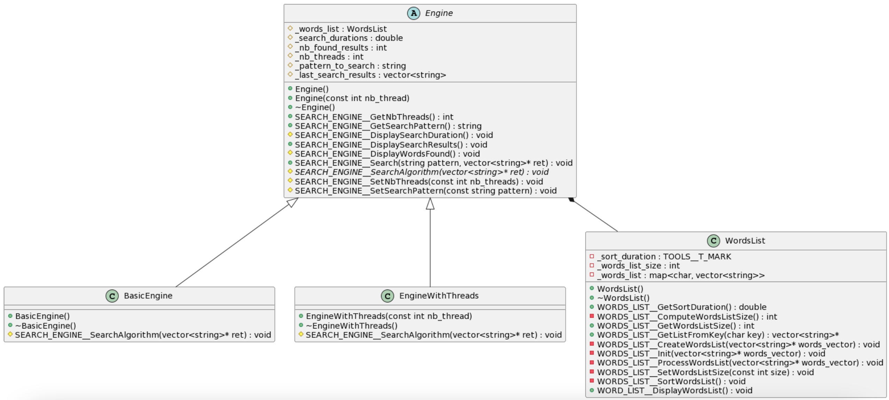

# ParallelSearch

## TABLE OF CONTENTS
- [Setup](#Setup)
- [Technical choices](#Technical-choices)
- [Search algorithm](#Search-algorithm)
- [Plant UML](#Plant-UML)

# Setup
To clone this repository, run the command:
```sh
git clone --branch=develop --recurse-submodules https://github.com/Xispa33/ParallelSearch.git
```

# Technical choices
Here is a quick recap of the technical choices made for the implementation of the algorithm
- Language: C++ version 11, use of OOP
- Compiler : clang compiler, use of CMake
- Version control: git
- Data structure: dictionnary
- Search algorithm: custom
- Tests: googletest framework for unit tests, use of assert.h for the rest

# Search algorithm
```
Search_Algorithm(pattern, words_list)
 
 inputs:
    variable pattern : string
    variable words_list : dictionnary 
 
 outputs:
    variable ret : list of string

 other variables:
    variable potential_words : list of string
    variable first_letter : char
    variable i : integer
 
 *******************

  first_letter = pattern[0]
  
  potential_words = words_list[first_letter]

 for word in potential_words:
    i = 1                   
    for letter in pattern:
        if letter != word[i]: 
            break;
        end if;
     
        if i == pattern.length():
            Add word to ret;
            break;
        end if;
    end for;

    if (ascii_value(letter) != ascii_value(word[i])):
        exit;
    end if
 end for;
```

# Plant UML
The figure below represents the UML diagram of the project.
<center></center>